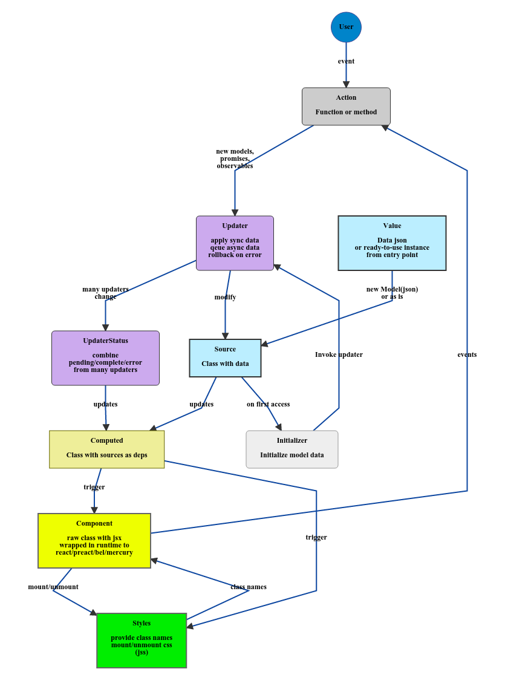

# reactive-di

Definitely complete solution for dependency injection, state-to-css, state-to-dom rendering, data loading, optimistic updates and rollbacks.

[Dependency injection](https://en.wikipedia.org/wiki/Dependency_injection) with [flowtype](http://flowtype.org/) support, based on [ds300 derivablejs](https://ds300.github.io/derivablejs/). For old browsers needs Map, Observable, Promise and optionally Reflect, Symbol polyfills.

No statics, no singletones, abstract everything, configure everything.

Features:
-   Annotation based and highly flow-compatible
-   Can resolve dependencies from [flowtype](http://flowtype.org/) interfaces, types, classes via [babel metadata plugin](https://github.com/zerkalica/babel-plugin-transform-metadata).
-   Each dependency is [Derivable](http://ds300.github.io/derivablejs/#derivable-Derivable) or [Atom](http://ds300.github.io/derivablejs/#derivable-Atom)
-   Can easily provide abstraction level on top of any state-to-dom manipulating library: [react](https://facebook.github.io/react/), [preact](https://preactjs.com/), [bel](https://github.com/shama/bel), [mercury](https://github.com/Raynos/mercury/), etc.
-   Provide themes support via state-to-css library, like [jss](https://github.com/jsstyles/jss)
-   Mimic to react: flow-compatible widgets with props autocomplete support, that looks like react, but without react dependencies
-   Hierarchical - can create local state per widget, like in [angular2 di](https://angular.io/docs/ts/latest/guide/hierarchical-dependency-injection.html)
-   Type based selectors
-   Data loading via promises or observables
-   Optimistic updates with rollbacks
-   About 2500 SLOC with tests, 1000 without
-   Suitable for both node and the browser

## Flow



## Basic entities

-   source(key, init, construct) - atom source: model with data or service, can be injected from outside and changed in runtime.
-   factory - mark function factory, if not used [babel metadata plugin](https://github.com/zerkalica/babel-plugin-transform-metadata)
-   deps(...deps: mixed[]) - declare dependencies, if not used [babel metadata plugin](https://github.com/zerkalica/babel-plugin-transform-metadata)
-   component(...deps: Function[]) - any visual component
-   theme - jss-like style
-   updater(...updaters: Updater[]) - create loading status from updater services
-   service - for optimisations, do not recalculate, if dependencies changed, only call constructor with new deps


## Complete example

Compile with [babel metadata plugin](https://github.com/zerkalica/babel-plugin-transform-metadata).

```js
// @flow
import React from 'react'
import ReactDOM from 'react-dom'
import jss from 'jss'

import {Updater, UpdaterStatus, Di, createReactWidgetFactory} from 'reactive-di'
import {theme, component, updaters, source, factory, updater} from 'reactive-di/annotations'
import {Component} from 'fake-react'

// Fetcher service, could be injected from outside by key 'Fetcher' as is
@source({key: 'Fetcher', construct: false})
class Fetcher {
    fetch<V>(url: string): Promise<V> {
        // fake fetcher for example
        return Promise.resolve((({name: string}): UserRec))
    }
}

// Create updater qeue for ThemeVars loader
class ThemeVarsUpdater extends Updater {
    // by default status is complete
    static pending: boolean = false;
}

// Create separate updater qeue for user
class UserUpdater extends Updater {
    // by default status is pending
    static pending: boolean = true;
}

// Get and combine pending/complete/error status from updater
@updaters(UserUpdater, ThemeVarsUpdater)
class SomeUpdaterStatus extends UpdaterStatus {}

interface UserRec {
    name?: string;
}

// Invokes once at User resolving, if no 'User' value specified at di.values(), calls Updater and fetch data
function userLoader(fetcher: Fetcher, updater: UserUpdater): void {
    updater.set([
        () => fetcher.fetch('/user')
    ])
}

// Model User, could be injected from outside by key 'User' as UserRec
@source({key: 'User', init: userLoader, construct: true})
class User  {
    name: string;
    constructor(r?: UserRec = {}) {
        this.name = r.name || 'unknown'
    }
}

interface ThemeVarsRec {
    color?: string;
}

function themeVarsLoader(fetcher: Fetcher, updater: ThemeVarsUpdater) {
    updater.set([
        () => fetcher.fetch('/theme-vars')
    ])
}

// Model ThemeVars, could be injected from outside by key 'ThemeVars' as ThemeVarsRec
@source({key: 'ThemeVars', init: themeVarsLoader, construct: true})
class ThemeVars {
    color: string;
    constructor(r?: ThemeVarsRec = {}) {
        this.color = r.color || 'red'
    }
}

// Provide class names and data for jss in __css property
@theme
class UserComponentTheme {
    wrapper: string;
    status: string;
    name: string;

    __css: mixed;

    constructor(vars: ThemeVars) {
        this.__css = {
            wrapper: {
                'background-color': `rgb(${vars.color}, 0, 0)`
            },
            status {
                'background-color': 'red'
            },
            name: {
                'background-color': 'green'
            }
        }
    }
}

class UserComponentActions {
    _updater: ThemeVarsUpdater;

    constructor(updater: ThemeVarsUpdater) {
        this._updater = updater
    }

    changeColor(): void {
        this._updater.set([
            new ThemeVars({color: 'green'})
        ])
    }
}

interface UserComponentProps {
    children?: mixed;
}

interface UserComponentState {
    theme: UserComponentTheme;
    user: User;
    loading: SomeUpdaterStatus;
    actions: UserComponentActions;
}

// Looks like react widget, flow compatible props
@component(UserComponentActions)
class UserComponent extends Component<UserComponentProps, UserComponentState> {
    props: UserComponentProps;
    state: UserComponentState;
    $: HTMLElement;

    // Babel plugin resolves dependencies from constructor
    constructor(state: UserComponentState) {super()}

    componentDidMount() {
        // do something with this.$
    }

    render(): mixed {
        const {
            children
        } = this.props
        const {
            theme,
            user,
            loading,
            actions
        } = this.state

        return <div className={theme.wrapper}>
            <span className={theme.status}>Loading status: {loading.type}</span>
            <span className={theme.name}>Name: {user.name}</span>
            {children}
            <button onClick={actions.changeColor}</button>
        </div>
    }
}

const node: HTMLElement = window.document.getElementById('app')
const render = (widget: Class<Component>, attrs: ?Object) => ReactDOM.render(React.createElement(widget, attrs), node)

const di = (new Di(
    createReactWidgetFactory(React.Component, ReactDOM.findDOMNode),
    (styles) => jss.createStyleSheet(styles)
))
    .values({
        Fetcher: new Fetcher()
    })

di.val(UserComponent).react((uc: Class<UserComponent>) => {
    render(uc)
})
```

More docs and examples coming soon.

### factory

### deps

### service

### source

### updaters

### theme

### component

## Manifest

-   DI as a glue, metaframework, abstraction from any framework, like react, angular, etc
-   Each dependency resolved by class definition to atom or derivable
-   Each dependency can be redefined at entry point
-   Do not use atoms, promises, observables, rxjs and another wrappers in you business code - move them to DI. Keep business code clean.
-   Do not use interfaces as dependency key - use abstract classes or real classes (you can redefine them at entry point)
-   Most of widgets has an own context - state, do not pass properties from hi-order to low-order, bind as dependency
-   Minimum pure stateless widgets - only for low-level primitives
-   Widget class must be flow-compatible (autocomplete props)
-   Hooks componentDidMount and etc - only for raw dom manipulation, move data-loading to state/action layer
-   No difference between html or css - all controlled via state, do not use cssmodules, sass, less, stylus - all them are static, use js classes or functions with all OOP features as interfaces, compositions.
-   JSX and CSSX better than template strings for parsing and ast manipulations
-   DI abstraction powerfull, redux is unnecessary. Use interceptors instead of middlewares, use atoms instead of reducers, use di-injected functions of classes instead of ugly dispatcher + action struct.

## Credits

* [Ninject](https://github.com/ninject/Ninject) best dependency injector, writen in C#.
* [inversify.io](http://inversify.io/) nice try of reimplementing Ninject in typescript.
* [angular2](https://angular.io) ideas of hierarchical injectors.
* [mobx](http://mobxjs.github.io/mobx/) ideas of unobtrusive reactive state.
* [derivablejs](http://ds300.github.io/derivablejs) core engine of reactive-di
* [babel-plugin-angular2-annotations](https://github.com/shuhei/babel-plugin-angular2-annotations) ideas of metadata for resolving dependencies.
* [babel-plugin-type-metadata](https://github.com/stephanos/babel-plugin-type-metadata) ideas of generating metadata for flowtypes.
